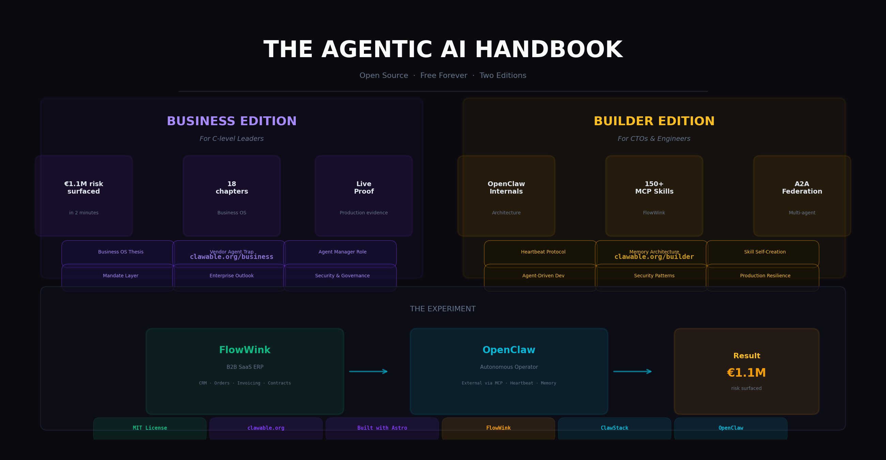

# The Agentic AI Handbook

> **Open source. Free forever. Two editions.** Contributions welcome.

[](LICENSE)
[](https://github.com/magnusfroste/clawable-handbook/issues)
[](https://github.com/magnusfroste/clawable-handbook/discussions)
[](#contributing)

<p align="center">
  
</p>

---

## What this is

A field report and architecture guide on autonomous AI agents — built from production evidence, not theory.

In April 2026, an external autonomous operator made a single unprompted pass across a live B2B SaaS ERP and surfaced **€1.1 million in risk, revenue gaps, and operational exposure** in under two minutes. No checklist. No human in the loop. The handbooks document what happened, why it matters, and how to build it.

---

## Two Editions

### [Business Edition](https://clawable.org/business) — for C-level leaders
*"It is not a pitch. It is a report."*

An evidence-based field report for CEOs, CFOs, and CPOs. What autonomous agents are doing to business operating systems right now — with real numbers, timestamps, and verified sources. Eighteen chapters covering the Business Operating System thesis, live production proof, the Vendor Agent Trap, security, the Agent Manager role, and what the first week of deployment looks like.

→ **[clawable.org/business](https://clawable.org/business)**

### [Builder Edition](https://clawable.org/builder) — for CTOs and engineers
*"Your AI agent is a chatbot. It should be a digital employee."*

The technical architecture guide. OpenClaw internals, heartbeat protocols, memory architecture, skill taxonomy, A2A federation, agent-driven development, security patterns, and production resilience. 33+ chapters and appendices covering the complete stack.

→ **[clawable.org/builder](https://clawable.org/builder)**

---

## The Experiment

**Platform:** [FlowWink](https://github.com/magnusfroste/flowwink) — a B2B SaaS ERP (CRM, Orders, Invoicing, Contracts, Expenses, Content, Newsletter, Support, Recruitment, Analytics). Built with [Lovable](https://lovable.dev) in weeks. Self-hosted, open source. 150+ MCP skills.

**Operator:** An external [OpenClaw](https://github.com/openclaw/openclaw) instance connected to FlowWink via MCP.

**FlowPilot** — FlowWink's embedded agent — was **OFF** during the experiment. The external operator alone was sufficient.

**What happened:** [Business Edition, Chapter 3 — Live Proof](https://clawable.org/business/03-live-proof)

---

## Repository Structure

```
src/
├── content/
│   ├── business/      # Business Edition chapters (18 + appendices)
│   └── builder/       # Builder Edition chapters (33+ chapters + appendices)
└── pages/
    ├── index.astro    # Umbrella landing (clawable.org)
    ├── business/      # Business Edition routes
    └── builder/       # Builder Edition routes

research/
── chapters/          # Business Edition manuscript source
── clawstack/         # FlowWink ↔ Clawable integration docs
├── flowwink/          # FlowWink platform research
├── references/        # Live proof logs, primary sources
├── resources/         # Curated Agentic AI reading list
└── archived/          # Historical research and superseded drafts
```

---

## Curated Resources

→ [Agentic AI Reading List](research/resources/agentic-ai-reading-list.md) — The most important protocols, frameworks, reports, and case studies in the field. MCP, A2A, OpenClaw, LangGraph, Gartner, McKinsey, HBR, Klarna.

---

## Related Projects

| Project | What it is |
|---------|-----------|
| [OpenClaw](https://github.com/openclaw/openclaw) | The reference operator framework (346k+ stars) |
| [FlowWink](https://github.com/magnusfroste/flowwink) | The SaaS ERP platform used as test environment |
| [ClawStack](https://github.com/magnusfroste/clawstack) | Self-hosted OpenClaw infrastructure |
| [Lovable](https://lovable.dev) | The platform FlowWink was built with |

---

## Contributing

This handbook is **open source and community-driven**. We want it to become the definitive resource on autonomous AI agents — and we need your help to make it great.

### Ways to contribute

- **Report errors** — Found a typo, broken link, or factual error? [Open an issue](https://github.com/magnusfroste/clawable-handbook/issues).
- **Request topics** — Missing a subject you think should be covered? [Start a discussion](https://github.com/magnusfroste/clawable-handbook/discussions).
- **Improve docs** — Better explanations, clearer examples, translations — all welcome.
- **Share your experience** — Deployed an agent using patterns from this handbook? We'd love to hear what worked and what didn't.

### How to contribute

1. **Fork** the repository
2. **Create a branch** for your change
3. **Make your changes** — content, code, or docs
4. **Test locally** with `npx astro dev`
5. **Open a pull request** — describe what you changed and why

No contribution is too small. A typo fix is as valuable as a new chapter.

### Good first issues

Look for the [`good first issue`](https://github.com/magnusfroste/clawable-handbook/labels/good%20first%20issue) label for beginner-friendly tasks to get started with.

---

## License

MIT — open source, free forever.

*Built by [Magnus Froste](https://www.froste.eu). Contributions welcome.*
